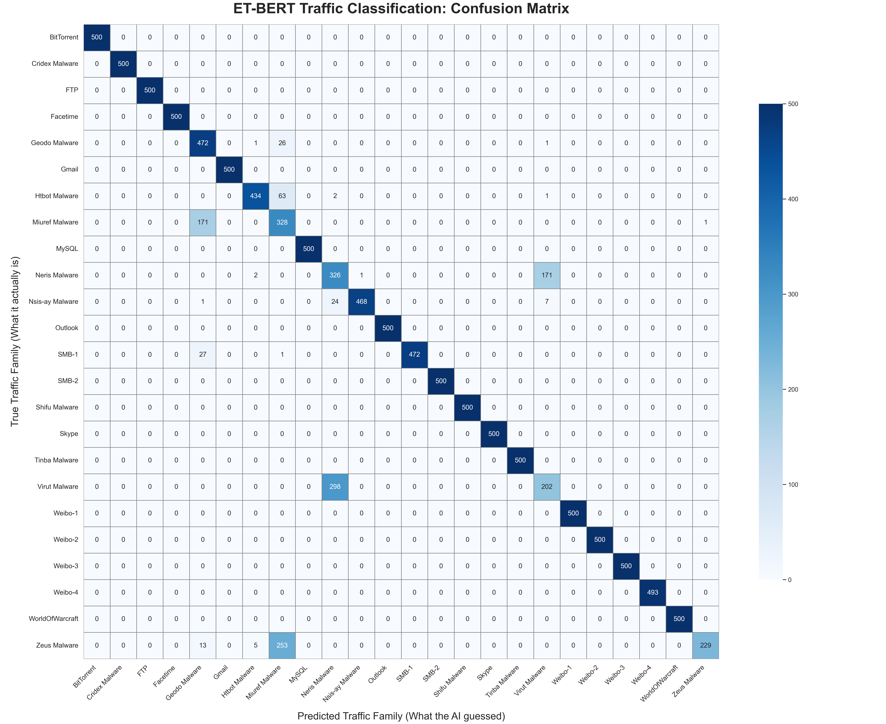
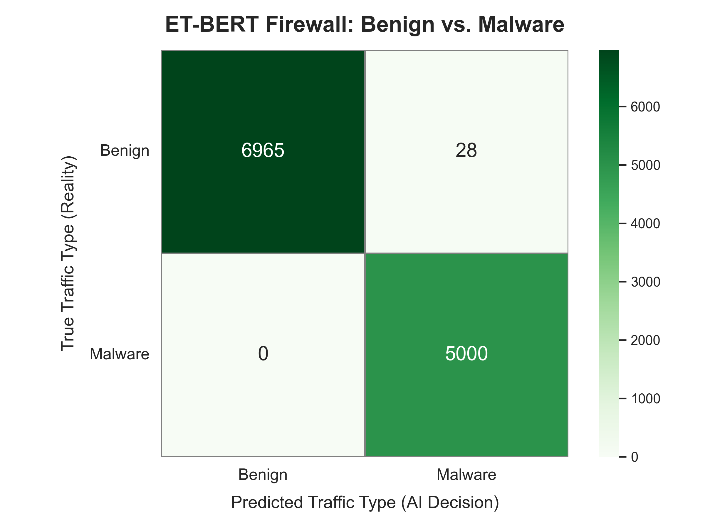
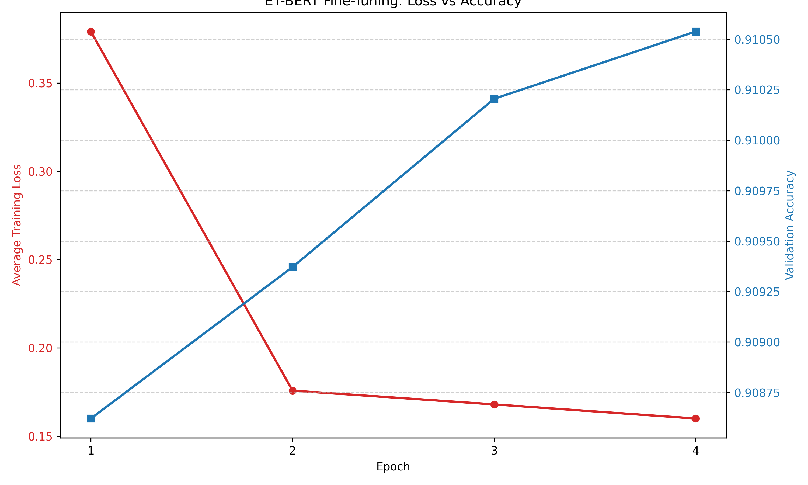
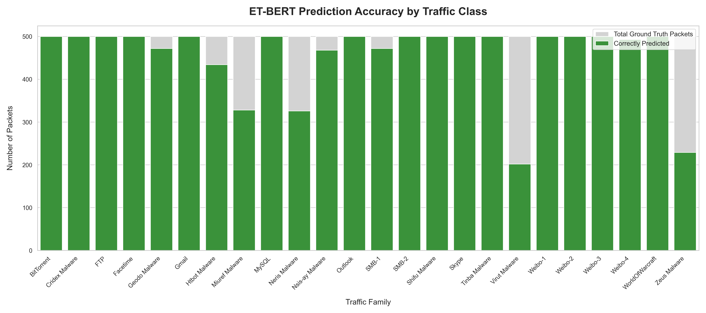

# Encrypted Network Traffic Classification using ET-BERT Architecture


**Author:** Nikhilesh Dubey  
**Architecture:** ET-BERT (Encrypted Traffic Bidirectional Encoder Representations from Transformers)  
**Framework:** UER-py / PyTorch  

👉 **[Click here to view the full Jupyter Notebook Walkthrough containing the code, step-by-step pipeline execution, and visual graphs.](JupyterNotebook.ipynb)**

---

## 1. Project Abstract & Motivation
As modern internet traffic becomes increasingly encrypted (via TLS/SSL, HTTPS, and VPNs), traditional Deep Packet Inspection (DPI) methods used by enterprise firewalls are losing their effectiveness. Firewalls can no longer rely on reading plain-text payloads or matching static signatures to identify malicious activity. 

While the [original ET-BERT repository](https://github.com/linwhitehat/ET-BERT) provided the theoretical foundation and base pre-trained weights for utilizing NLP Transformers on network traffic, it lacked a public, end-to-end implementation for custom datasets. 

**This repository bridges that gap.** It provides a complete, workable pipeline that implements the ET-BERT architecture on a real-world dataset. By treating raw, encrypted network bytes as "words" in a sequence, the model utilizes multi-head self-attention mechanisms to learn the structural grammar and behavioral fingerprint of different network applications. This allows the system to accurately classify 24 distinct families of malware and benign applications entirely from encrypted payloads, without requiring decryption keys.

## 📁 External Data & Model Zoo

Due to GitHub’s storage limitations, the high-volume binary files (PCAPs and Model Weights) are hosted externally. Depending on your goals, download the necessary components below:

### 1. Raw Network Traffic (.pcap)
To run the preprocessing pipeline (Phase 0 and Phase 1) and generate your own datasets, download the 24-class packet captures:
* [**Download Raw PCAP Dataset**](https://drive.google.com/file/d/1AEDxZRAh8ClpiEYpuFU-5WMyd_YWVI-R/view?usp=sharing)
    * *Includes: 24 individual application/malware captures.*

---

### 2. ET-BERT Model Weights
We provide two versions of the model architecture depending on whether you wish to train from scratch or run immediate inference.

| Resource | Purpose | Download Link |
| :--- | :--- | :--- |
| **Pre-trained Model** | **For Training:** Download this if you want to fine-tune the ET-BERT architecture on your own custom dataset or re-run my fine-tuning experiments. | [**Download Pre-trained Weights**](https://drive.google.com/file/d/1Zah1YSjT2SgDvi-YNR5CzOHkwGJiS9_W/view?usp=sharing) |
| **Fine-tuned Model** | **For Inference:** Download this if you want to skip training and immediately deploy the model to classify live or captured network traffic. | [**Download Fine-tuned Weights**](https://drive.google.com/file/d/1LUaN4jnLA11ipAbqhBVm08Jf_w5dmExb/view?usp=sharing) |


---

### 🛠 Setup Instructions for Downloads
After downloading the files, place them in the following directory structure to ensure the Jupyter Notebook paths work correctly:

```text
ET-BERT-Project/
├── Data/
│   └── (Place .pcap files here)
├── Model/
│   ├── pretrained_model.bin
│   └── finetuned_model.bin
└── ... (rest of the repo)
```

## 2. About ET-BERT & Methodology
ET-BERT pioneers a new paradigm by adapting the Transformer encoder architecture (originally designed for Natural Language Processing) to the cybersecurity domain. 

* **Datagram2Token:** Rather than treating traffic as 1D images (like CNNs) or relying on manual statistical features (like packet inter-arrival times), ET-BERT converts raw binary packet payloads into two-character hexadecimal tokens (bigrams). 
* **Model Blueprint:** * **Layers:** 12 Transformer Encoder Blocks
  * **Attention:** 12 Multi-Head Attention Heads per layer
  * **Hidden Size:** 768 dimensions
  * **Sequence Length:** Capped at the first 128 bytes of the packet payload.
* **Vocabulary:** The model utilizes a custom vocabulary of 261 tokens (256 standard hex bytes from `00` to `ff`, plus 5 special control tokens: `[PAD]`, `[UNK]`, `[CLS]`, `[SEP]`, `[MASK]`).
* **Optimization:** The model is fine-tuned using Cross-Entropy Loss, and performance is evaluated using Top-1 Classification Accuracy.


## 3. The Dataset & Preparation
The dataset consists of raw `.pcap` (Packet Capture) files representing 24 distinct traffic classes, divided into both benign applications (Skype, Gmail, BitTorrent) and sophisticated malware families (Zeus, Miuref, Virut). 

* **Data Splitting (PowerShell):** To prepare the raw data, a custom PowerShell (`.ps1`) script was utilized to efficiently divide the 24 massive, monolithic `.pcap` captures into manageable, isolated components before extraction.
* **Sanitization:** To prevent data leakage and force the model to learn deep payload behavior rather than memorizing simple network topologies, all Data Link (MAC) and Network (IP) layer headers were actively stripped using `tshark`.
* **Balancing:** To prevent the model from overfitting to high-volume applications, the dataset is strictly balanced and capped at a maximum of **5,000 communication flows per class**.

## 4. Hardware Environment & Constraints
* **Environment:** Local Windows Deployment
* **Hardware:** NVIDIA RTX 4060 Laptop GPU (8GB VRAM)
* **Memory Optimizations:** Due to the strict 8GB VRAM constraint and the O(N^2) memory complexity of Transformer self-attention matrices, the fine-tuning phase was optimized using a reduced `--batch_size` of 16 and the `PYTORCH_CUDA_ALLOC_CONF="expandable_segments:True"` environment variable to prevent memory fragmentation.

## 5. Results & Conclusion

This project successfully demonstrates the viability of utilizing foundation models to solve complex cybersecurity challenges. The end-to-end pipeline bridged the gap between traditional network engineering and deep learning.

### The Multi-Class Mimicry Challenge (~91% Accuracy)
The initial 24-class evaluation yielded a strong ~91% baseline accuracy but uncovered critical behavioral realities of modern malware. The confusion matrix revealed that the model's errors were highly concentrated among specific malware twins (e.g., Zeus mimicking Miuref, and Virut mimicking Neris). 

This proved that at a sequence length of 128 bytes, advanced banking trojans and polymorphic botnets share nearly identical initial packet structures—likely utilizing standardized HTTP/TLS headers to communicate with Command and Control (C2) servers. The model successfully recognized the traffic as malicious but lacked the deeper payload context to differentiate the specific family names.

### Enterprise Security Posture (99.76% Binary Firewall Accuracy)
When evaluated under the parameters of a real-world enterprise firewall—where the primary objective is simply segregating safe traffic from dangerous traffic—the model achieved an exceptional **99.76% accuracy**.
* **Zero False Negatives:** The model successfully intercepted 5,000 out of 5,000 malware packets. In a production Security Operations Center (SOC), eliminating False Negatives is the highest priority, ensuring no active threats bypass the perimeter.
* **Minimal False Positives:** Out of nearly 7,000 benign application packets, only 28 were incorrectly flagged (a 0.4% false alarm rate), ensuring legitimate business operations are not disrupted.

## 6. Performance Visualizations

To truly understand the model's behavior and the realities of modern network threats, we visualize its predictions using Confusion Matrices.

### 1. The 24-Class Evaluation (The Mimicry Problem)
This heatmap illustrates the model's baseline performance across all 24 individual classes. While the model achieves a strong ~91% accuracy, the concentrated clusters off the main diagonal reveal that the AI is not failing randomly. Instead, it highlights the structural overlap between identical malware families—specifically **Zeus** being misclassified as **Miuref**, and **Virut** as **Neris**. 



### 2. The Enterprise Firewall Evaluation (Benign vs. Malware)
When we collapse the overlapping malware families and evaluate the model strictly as a binary firewall (safe vs. dangerous), the accuracy skyrockets to **99.76%**. The matrix below proves the model's viability in a production environment: it allowed only 28 False Positives and achieved **zero False Negatives** across 5,000 malicious packets.



### 3. Model Convergence (Training Loss & Validation Accuracy)
To ensure the model was actively learning the structural grammar of the network payloads rather than simply memorizing the training data, we tracked the loss and accuracy metrics across the fine-tuning epochs. 

The learning curve below demonstrates a healthy convergence. As the model progressed through the 4 epochs, the training loss steadily decreased while the validation accuracy stabilized, proving that the Transformer successfully generalized its understanding of the 24 traffic classes without severe overfitting.



### 4. Per-Class Prediction Accuracy (Ground Truth vs. Correct)
To provide a granular breakdown of where the model excels and where it struggles, we mapped the raw prediction counts for all 24 individual classes. 

This bar chart compares the total number of actual packets (Ground Truth) directly against the number of packets the AI correctly identified. This visualization makes it instantly clear that while benign applications (like Skype, Gmail, and MySQL) achieve near-perfect 500/500 scores, the model's missed predictions are strictly isolated to the specific polymorphic malware families engaging in structural mimicry.



## 7. Future Scope
While the current architecture is highly effective, future iterations of this pipeline could explore:
* **Extended Sequence Lengths:** Increasing the `--seq_length` to 256 or 512 tokens to allow the self-attention mechanism to read past generic protocol headers and identify deeper, unique malware signatures.
* **Ensemble "Sniper" Modeling:** Deploying this model as a Tier-1 binary filter, which routes flagged malware packets to a heavier, specialized Tier-2 model trained exclusively to categorize specific threat families.

## Acknowledgements
* Base theoretical architecture and pre-trained weights provided by the [original ET-BERT repository](https://github.com/linwhitehat/ET-BERT) by [Xinjie Lin](https://github.com/linwhitehat).
